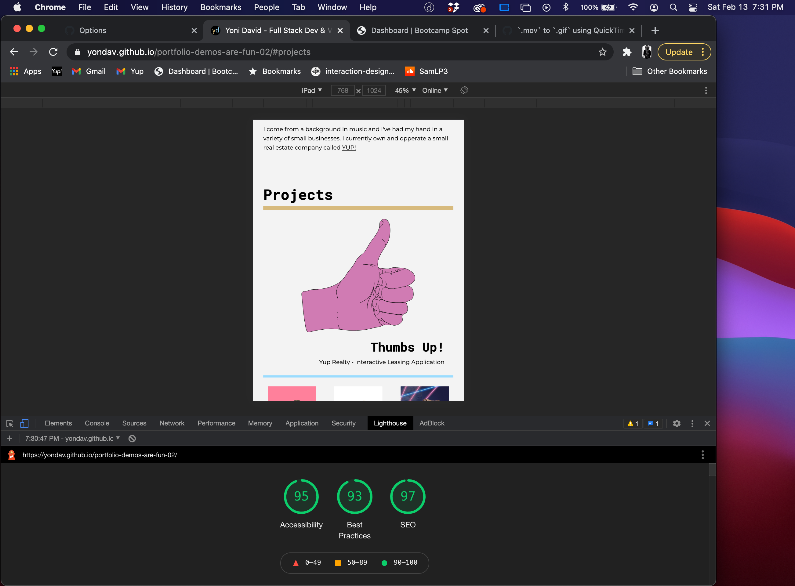

# portfolio-demos-are-fun-02

Yoni David is an aspiring full stack web developer and visual designer. He's currently enrolled in Columbia University's Full Stack Web Development Bootcamp and is demoing a simple portfolio layout using html and css.

## Deployed Webpage
https://yondav.github.io/portfolio-demos-are-fun-02/

## Page Sections

### About
Includes a self portrait drawn in Adobe Illustrator and a brief bio.

### Projects
Includes a layout designed for various screen sizes using flex-box. The projects are mostly dead links as Yoni is just starting his journey into web development. The primary link to https://www.yupny.com/apply is a live leasing application Yoni built and designed for Yup Realty using Jot Form. Yoni was the sole designer on the project in which he did all of the illustrations and built the application using Jot Form's platform with minimal additions in html and css.

### Contact
Includes an email form built with html and styled with css. 

## Please follow these steps to navigate the repository
- Ensure you are on the main branch
- Open index.html to access the html file
- Nested in the assets folder, you will find two folders titled css and images
- You can access the css stylesheets: reset.css, style.css by opening the css folder and selecting the desired file
- All images used throughout the webpage are in the images folder and can be accessed there
- The gifs and screenshot provided in this README file are located in the folder titled README-assets

The assignment at hand was to build a simple portfolio from scratch using html and css. I had spent a lot of time this week playing with some ideas I had for a more complex website and diving into using javascript. Ultimately I scrapped that site for the sake of submitting something I was more confident in my ability to complete but I did learn a lot this week while working on this project. This was a great exercise in thinking about html structure and understanding the ways that different css methods work and how they respond to one another. 

Additionally, my exploration of simple javascript has left me in a pretty exciting place. I was able to accomplish a few things that I spent countless hours trying to wrap my head around. Overall I enjoyed this project for those reasons. I learned quite a bit and I think I came out of it with a skeleton to build on in the future.

Copyright (c) [2021] [Jonathan David]
