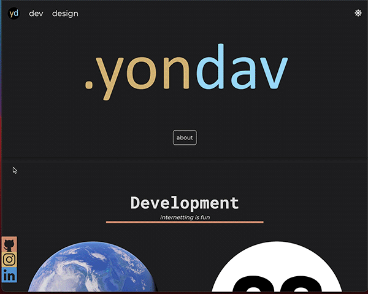
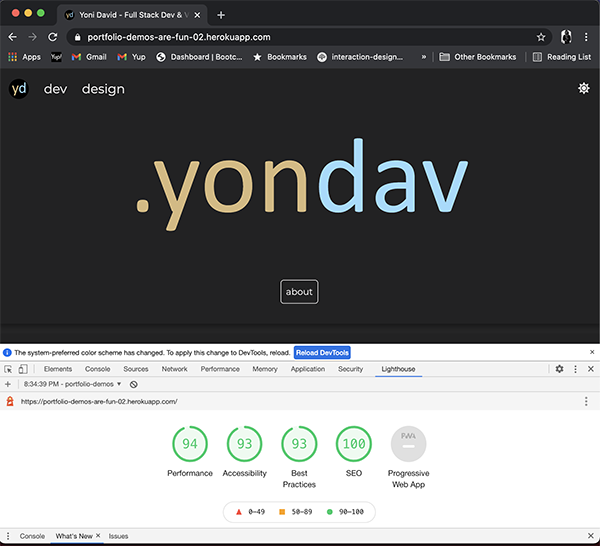

# Updated Portfolio

[](https://opensource.org/licenses/MIT)

For this assignment, I decided to challenge myself and try a few things I had never done before. I tried to create a more fun and dynamic UI with JavaScript and CSS. I also worked with node for the first time to set up a server and accept email submissions from the contact form.

## Deployed Webpage

https://portfolio-demos-are-fun-02.herokuapp.com/

### Responsive Layout


### Dynamic Scrolling, Sticky-Nav, Mouse Events


### Dynamic Single Page Design



## Featured Dev

## 

### The Other Side

- <a href= "https://ssharmin0029.github.io/project1/index.html">deployed</a>
- <a href= "https://github.com/yondav/project1">repo</a>

### Coding Chops The Game

- <a href= "https://yondav.github.io/05-coding-chops-the-game/">deployed</a>
- <a href= "https://github.com/yondav/05-coding-chops-the-game">repo</a>

### Weather App

- <a href= "https://yondav.github.io/07-weather-app/">deployed</a>
- <a href= "https://github.com/yondav/07-weather-app">repo</a>

### Work Day

- <a href= "https://yondav.github.io/06-day-planner/">deployed</a>
- <a href= "https://github.com/yondav/06-day-planner">repo</a>

---

### Featured Design


### Takeaway

It's been a lot of fun challenging myself to create a dynamic and fun experience on my portfolio page. This being the second phase my portfolio since starting the course made very clear how far my skills and intuition have come. It's certainly not perfect and it is all pretty vanilla but I did learn a lot and I'm excited to have accomplished things I had never tried before. This will be a fun thing to continue revisiting and refactoring over time but it was very exciting to work on this.

---

## Repo

```
### Root Directory

- package.json
- package-lock.json
- server.js
- .gitignore
- public
  - assets
    - css
      - animations.css
      - reset.css
      - style.css
    - js
     - app.js
    - images
      - ** all imagery **
    - README-assets
      - readme imagery and gifs

```

---

## Lighthouse

## 

## Built With

### HTML

### CSS

### JavaScript

### <a href= "https://nodejs.org/en/">Node.JS</a>

### <a href= "https://expressjs.com/">Express</a>

### <a href= "https://nodemailer.com/about/">Nodemailer</a>

### Deployed using <a href= "https://www.heroku.com/">Heroku</a>

---

Copyright (c) [2021] [Jonathan David]
